# COVID-19-new-interesting-pattern
# CHAPTER 1: CONCEPTS OF DATA MINING

### 1.1 ASSOCIATION RULE MINING

Association Rule Mining, as the name suggests, association rules are simple If/Then statements that help discover relationships between seemingly independent relational databases or other data repositories.

Most machine learning algorithms work with numeric datasets and hence tend to be mathematical. However, association rule mining is suitable for non-numeric, categorical data and requires just a little bit more than simple counting.

Association rule mining is a procedure which aims to observe frequently occurring patterns, correlations, or associations from datasets found in various kinds of databases such as relational databases, transactional databases, and other forms of repositories. **An association rule has 2 parts:**

- **an antecedent (if) and**
- **a consequent (then)** An antecedent is something that&#39;s found in data, and a consequent is an item that is found in combination with the antecedent. Have a look at this rule for instance:

&quot;_If a customer buys bread, he&#39;s 70% likely of buying milk.&quot;_

In the above association rule, bread is the antecedent and milk is the consequent. Simply put, it can be understood as a retail store&#39;s association rule to target their customers better. If the above rule is a result of a thorough analysis of some data sets, it can be used to not only improve customer service but also improve the company&#39;s revenue.

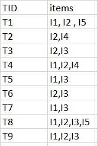

1. **Support** : Support indicates how frequently the if/then relationship appears in the database.
2. **Confidence** : Confidence tells about the number of times these relationships have been found to be true. So, in a given transaction with multiple items, Association Rule Mining primarily tries to find the rules that govern how or why such products/items are often bought together. For example, peanut butter and jelly are frequently purchased together because a lot of people like to make PB&amp;J sandwiches. [A](https://upgrad.com/blog/a-beginners-guide-to-data-science-and-its-applications/)[Beginner&#39;](https://upgrad.com/blog/a-beginners-guide-to-data-science-and-its-applications/)[s](https://upgrad.com/blog/a-beginners-guide-to-data-science-and-its-applications/)[Guid](https://upgrad.com/blog/a-beginners-guide-to-data-science-and-its-applications/)[e](https://upgrad.com/blog/a-beginners-guide-to-data-science-and-its-applications/)[t](https://upgrad.com/blog/a-beginners-guide-to-data-science-and-its-applications/)[o](https://upgrad.com/blog/a-beginners-guide-to-data-science-and-its-applications/)[Dat](https://upgrad.com/blog/a-beginners-guide-to-data-science-and-its-applications/)[a](https://upgrad.com/blog/a-beginners-guide-to-data-science-and-its-applications/)[Scienc](https://upgrad.com/blog/a-beginners-guide-to-data-science-and-its-applications/)[e](https://upgrad.com/blog/a-beginners-guide-to-data-science-and-its-applications/)[an](https://upgrad.com/blog/a-beginners-guide-to-data-science-and-its-applications/)[d](https://upgrad.com/blog/a-beginners-guide-to-data-science-and-its-applications/)[It](https://upgrad.com/blog/a-beginners-guide-to-data-science-and-its-applications/)[s](https://upgrad.com/blog/a-beginners-guide-to-data-science-and-its-applications/)[Application](https://upgrad.com/blog/a-beginners-guide-to-data-science-and-its-applications/)[s](https://upgrad.com/blog/a-beginners-guide-to-data-science-and-its-applications/)

### 1.2 APRIORI ALGORITHM

**Apriori algorithm** is given by R. Agrawal and R. Srikant in 1994 for finding frequent itemsets in a dataset for boolean association rule. Name of the algorithm is Apriori because it uses prior knowledge of frequent itemset properties. We apply an iterative approach or level-wise search where k-frequent itemsets are used to find k+1 itemsets. To improve the efficiency of level-wise generation of frequent itemsets, an important property is used called _Apriori property_ which helps by reducing the search space.

#### Apriori Property –

All non-empty subset of frequent itemset must be frequent. The key concept of Apriori algorithm is its anti-monotonicity of support measure. Apriori assumes that

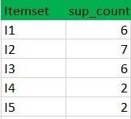

_All subsets of a frequent itemset must be frequent(Apriori propertry). If an itemset is infrequent, all its supersets will be infrequent._

Before we start understanding the algorithm, go through some definitions which are explained in my previous post.

Consider the following dataset and we will find frequent itemsets and generate association rules for them.

minimum support count is 2 minimum

confidence is 60%

**Step-1:** K=1

(I)Create a table containing support count of each item present in dataset – Called

#### C1(candidate set)

(II)compare candidate set item&#39;s support count with minimum support count(here min\_support=2 if support\_count of candidate set items is less than min\_support then remove those items). This gives us itemset L1.

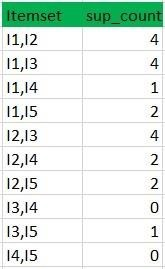

#### Step-2: K=2

- Generate candidate set C2 using L1 (this is called join step). Condition of joining Lk-1 and Lk-1 is that it should have (K-2) elements in common.
- Check all subsets of an itemset are frequent or not and if not frequent remove that itemset.(Example subset of{I1, I2} are {I1}, {I2} they are frequent.Check for each itemset)
- Now find support count of these itemsets by searching in dataset.

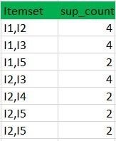

(II) compare candidate (C2) support count with minimum support count(here min\_support=2 if support\_count of candidate set item is less than min\_support then remove those items) this gives us itemset L2.

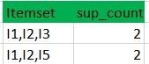

**Step-3:**

Generate candidate set C3 using L2 (join step). Condition of joining Lk-1 and Lk-1 is that it should have (K2) elements in common. So here, for L2, first element should match.

So itemset generated by joining L2 is {I1, I2, I3}{I1, I2, I5}{I1, I3, i5}{I2, I3, I4}{I2, I4, I5}{I2, I3, I5}

Check if all subsets of these itemsets are frequent or not and if not, then remove that itemset.(Here subset of {I1, I2, I3} are {I1, I2},{I2, I3},{I1, I3} which are frequent. For {I2, I3, I4}, subset {I3, I4} is not frequent so remove it. Similarly check for every itemset) •find support count of these remaining itemset by searching in dataset.

(II) Compare candidate (C3) support count with minimum support count(here min\_support=2 if support\_count of candidate set item is less than min\_support then remove those items) this gives us itemset L3.
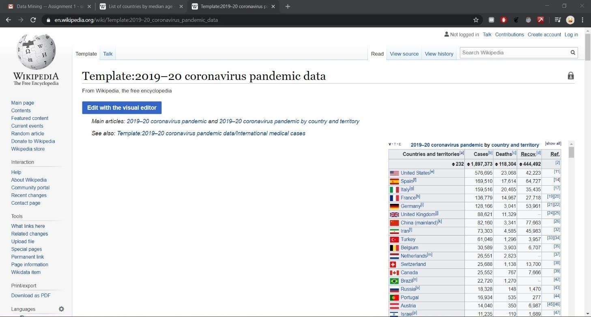

**Step-4:** • Generate candidate set C4 using L3 (join step). Condition of joining Lk-1 and Lk-1 (K=4) is that, they should have (K-2) elements in common. So here, for L3, first 2 elements (items) should match. • Check all subsets of these itemsets are frequent or not (Here itemset formed by joining L3 is {I1, I2, I3, I5} so its subset contains {I1, I3, I5}, which is not frequent). So no itemset in C4

• We stop here because no frequent itemsets are found further

Thus, we have discovered all the frequent item-sets. Now generation of strong association rule comes into picture. For that we need to calculate confidence of each rule.

#### Confidence –

A confidence of 60% means that 60% of the customers, who purchased milk and bread also bought butter.

Confidence(A-\&gt;B)=Support\_count(A  B)/Support\_count(A)

So here, by taking an example of any frequent itemset, we will show the rule generation. Itemset {I1, I2, I3} //from L3

SO rules can be

[I1^I2]=\&gt;[I3] //confidence = sup(I1^I2^I3)/sup(I1^I2) = 2/4\*100=50% [I1^I3]=\&gt;[I2] //confidence = sup(I1^I2^I3)/sup(I1^I3) = 2/4\*100=50%

[I2^I3]=\&gt;[I1] //confidence = sup(I1^I2^I3)/sup(I2^I3) = 2/4\*100=50%

[I1]=\&gt;[I2^I3] //confidence = sup(I1^I2^I3)/sup(I1) = 2/6\*100=33%

[I2]=\&gt;[I1^I3] //confidence = sup(I1^I2^I3)/sup(I2) = 2/7\*100=28% [I3]=\&gt;[I1^I2] //confidence = sup(I1^I2^I3)/sup(I3) = 2/6\*100=33%

So if minimum confidence is 50%, then first 3 rules can be considered as strong association rules.

# CHAPTER 2: DATA MINING

**2.1 STEPS OF DATA MINING:**

There are various steps that are involved in mining data as

1. Data collection
2. Data Cleaning
3. Data Integration
4. Data transformation
5. Data mining
6. Pattern Evaluation and Knowledge Presentation

### 2.2 STEPS

#### 2.2.1 Data collection

All the COVID-19 related data was collected from a single Wikipedia page using a web scrapper automatically.

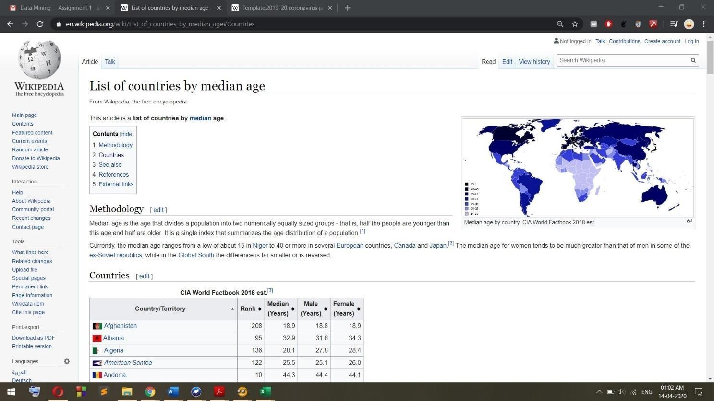

We also used the same site to collect the median ages of different countries i.e. Wikipedia

#### 2.2.2 Data Cleaning

The data we have collected may contain errors, missing values, noisy or inconsistent data. So, we get rid of such anomalies. This step was very time consuming, due to all the manual work required.

In this step, we used orange to rename the files to represent the dates when the data was captured and to remove inconsistencies such as the use of abbreviations like &quot;UK&quot;, &quot;US&quot; to represent

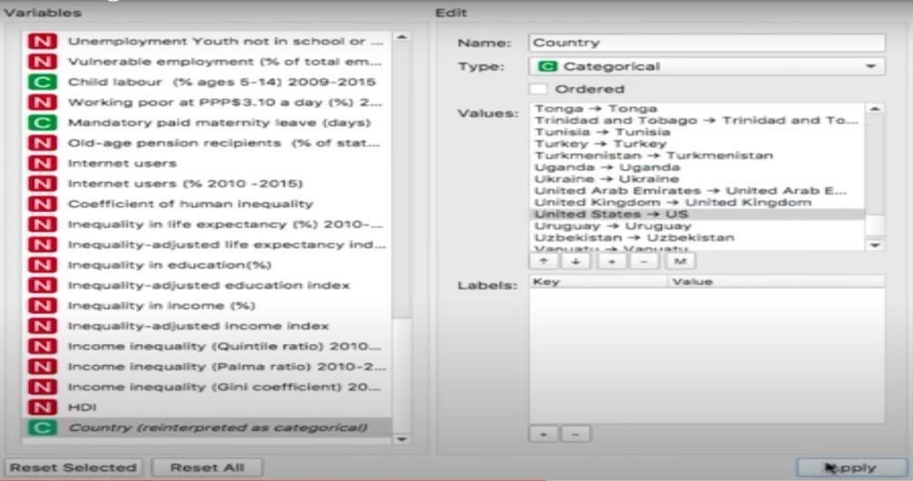

#### 2.2.3 Data Integration

Data cleaning in data mining is the process of detecting and removing corrupt or inaccurate records from a record set, table or database. 1 You can ignore the tuple. This is done when class label is missing. This method is not very effective , unless the tuple contains several attributes with missing values.

#### 2.2.4 Data Transformation

In computing, Data transformation is the process of converting data from one format or structure into another format or structure. It is a fundamental aspect of most data integration and data management tasks such as data wrangling, data warehousing, data integration and application integration.

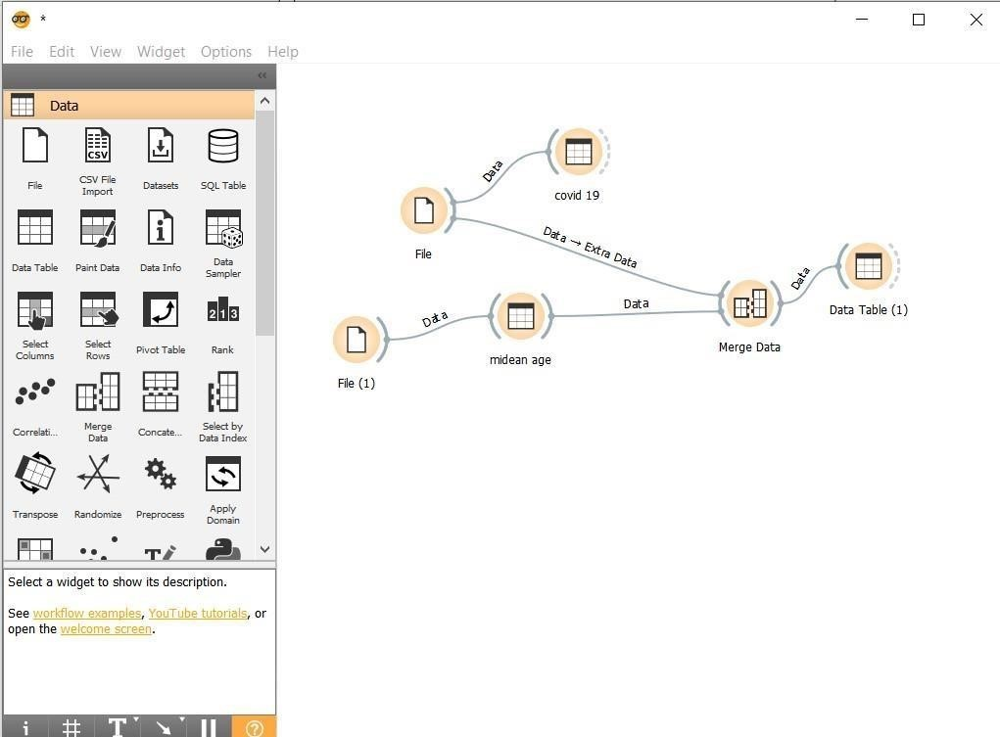

#### 2.2.5 Data Mining

Data mining is the process of discovering patterns in large data sets involving methods at the intersection of machine learning, statistics, and database systems.[1] Data mining is an interdisciplinary subfield of computer science and statistics with an overall goal to extract information (with intelligent methods) from a data set and transform the information into a comprehensible structure for further use

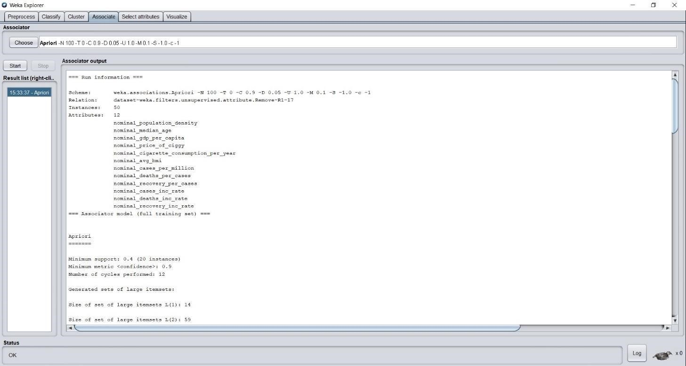

#### 2.2.6 Pattern Evaluation and Knowledge Presentation

This step involves visualization, transformation, removing redundant patterns etc from the patterns we generated.

# CHAPTER 3: SOFTWARE USED

### 3.1 WEKA

WEKA - an open source software provides tools for data preprocessing, implementation of several Machine Learning algorithms, and visualization tools so that you can develop machine learning techniques and apply them to real-world data mining problems. What WEKA offers is summarized in the following diagram −

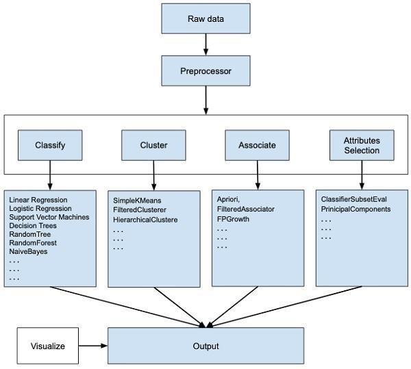

If you observe the beginning of the flow of the image, you will understand that there are many stages in dealing with Big Data to make it suitable for machine learning −

First, you will start with the raw data collected from the field. This data may contain several null values and irrelevant fields. You use the data preprocessing tools provided in WEKA to cleanse the data.

Then, you would save the preprocessed data in your local storage for applying ML algorithms.

Next, depending on the kind of ML model that you are trying to develop you would select one of the options such as **Classify, Cluster** , or **Associate**. The **Attributes Selection** allows the automatic selection of features to create a reduced dataset.

Note that under each category, WEKA provides the implementation of several algorithms. You would select an algorithm of your choice, set the desired parameters and run it on the dataset.

Then, WEKA would give you the statistical output of the model processing. It provides you a visualization tool to inspect the data.

The various models can be applied on the same dataset. You can then compare the outputs of different models and select the best that meets your purpose.

Thus, the use of WEKA results in a quicker development of machine learning models on the whole.

Now that we have seen what WEKA is and what it does, in the next chapter let us learn how to install WEKA on your local computer.

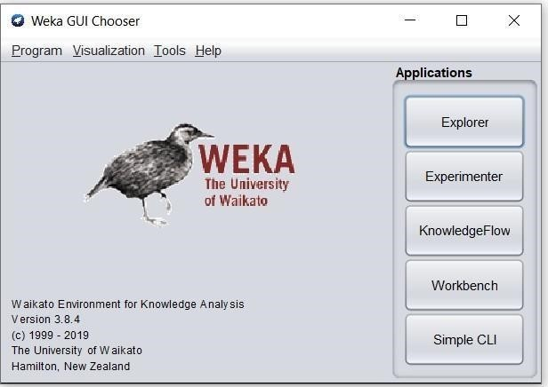

### 3.2 Orange

Orange is a component-based visual programming software package for data visualization, machine learning, data mining, and data analysis.

Orange components are called widgets and they range from simple data visualization, subset selection, and preprocessing, to empirical evaluation of learning algorithms and predictive modeling.

Visual programming is implemented through an interface in which workflows are created by linking predefined or user-designed widgets, while advanced users can use Orange as a Python library for data manipulation and widget alteration

# CHAPTER 4: PATTERNS FOUND

### 4.1 SMOKING AND BEING OVERWEIGHT ATTRACTS COVID19

As per the above research done , we found an intrusting pattern .According to which if a country has HIGH GDP per capita i.e. rich , median age is old is combined with high cigarette consumption per year and average BMI i.e. body mass index is FAT .

Then there are high chances of COVID-19 to spread in that area and infect more people .

As Covid19 is a respiratory disease, it was obvious that Covid19 will be more harmful to smokers than non-smokers. What is surprising, though that smoking is only been a key factor where population density is high.

Also , Obesity can weaken the body&#39;s immune system and reduce its ability to fight off infections.

